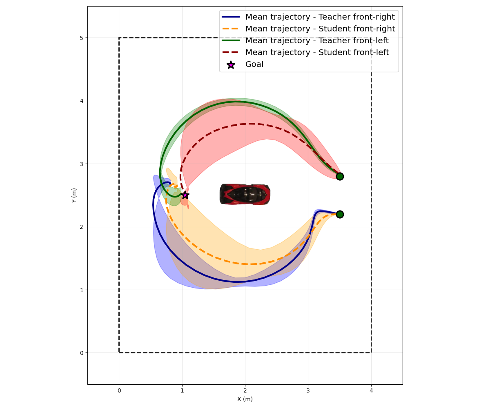
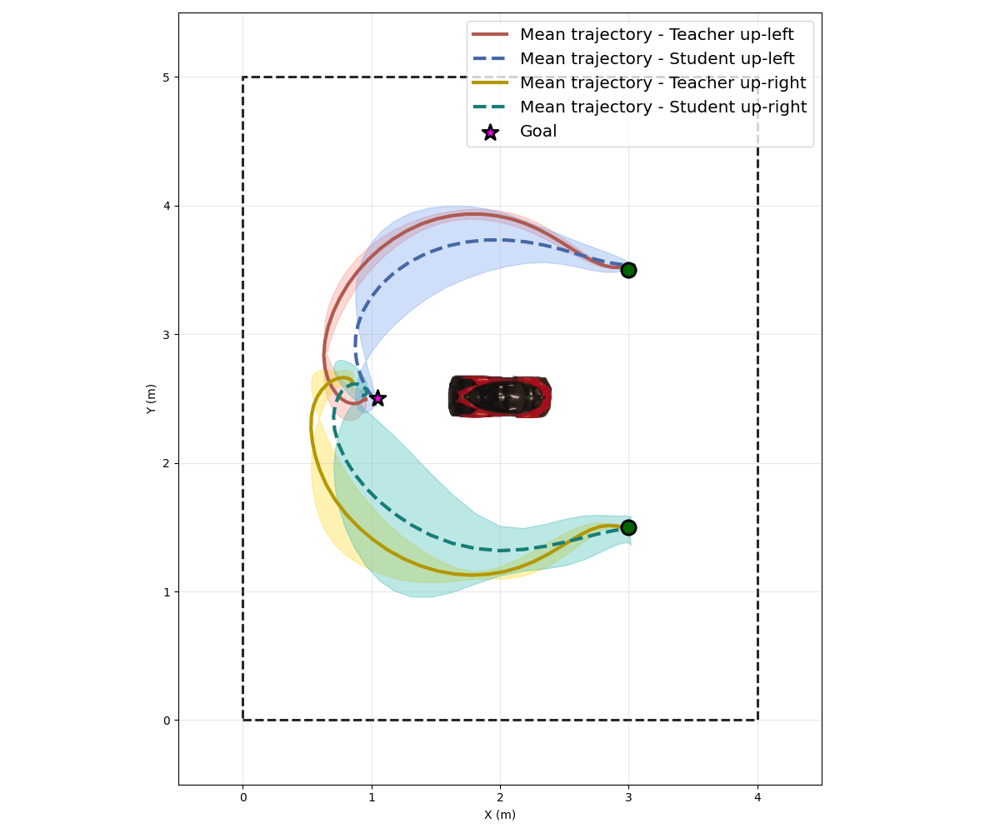
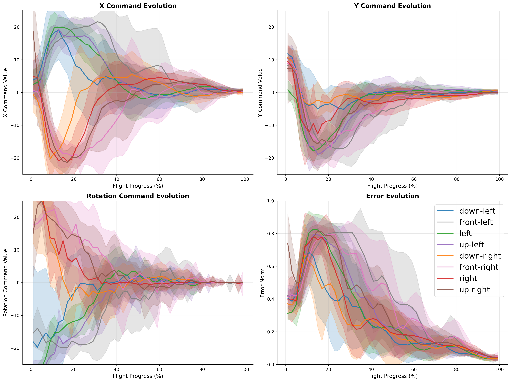
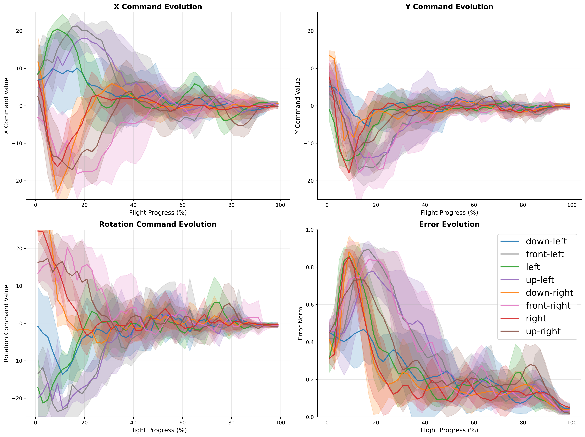
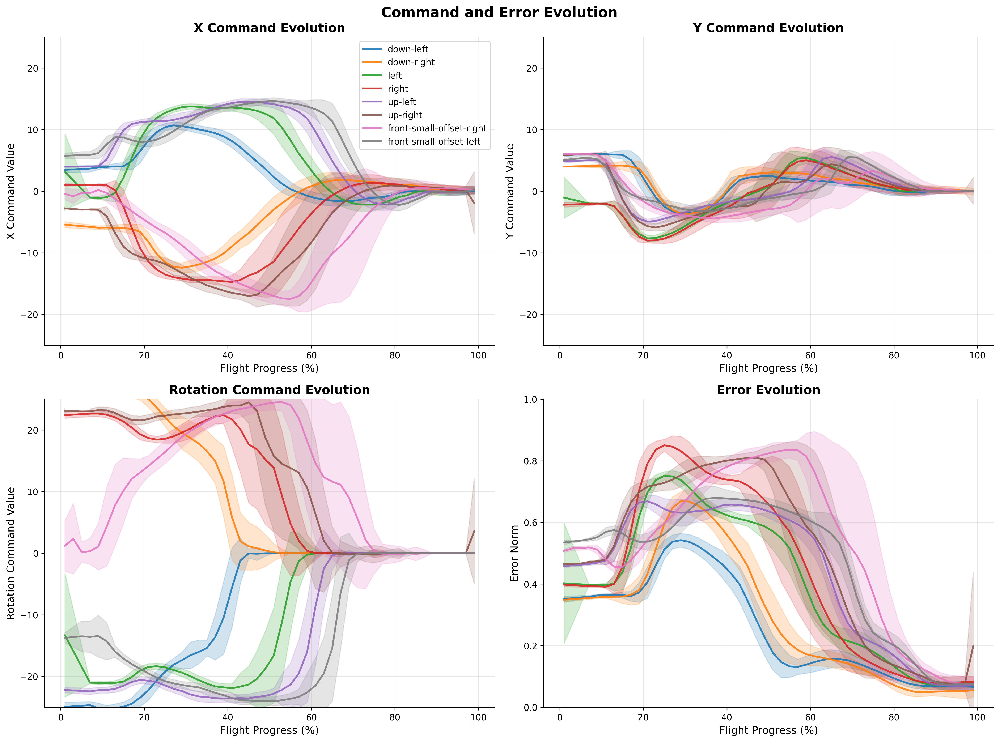
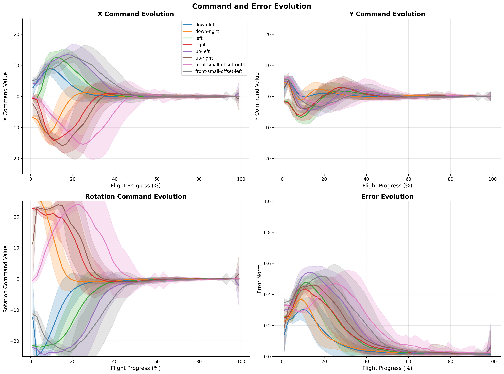

<div align="center">

# NSER-IBVS: Efficient Self-Supervised Neuro-Analytic Visual Servoing for Real-time Quadrotor Control

[](https://github.com/SpaceTime-Vision-Robotics-Laboratory/auto-follow/actions/workflows/ubuntu.yml)
[](https://github.com/SpaceTime-Vision-Robotics-Laboratory/auto-follow/actions/workflows/ruff_linter.yml)
[](https://www.python.org/downloads/)
[](https://opensource.org/license/afl-3-0-php)

[Sebastian Mocanu](https://sebastianmocanu.com/), [Sebastian-Ion Nae](https://scholar.google.com/citations?user=VBogtPAAAAAJ&hl=en),
[Mihai-Eugen Barbu](https://scholar.google.com/citations?user=9GlsUHAAAAAJ&hl=en), [Marius Leordeanu](https://scholar.google.com/citations?user=se9kni0AAAAJ&hl=en)

[](https://openaccess.thecvf.com/content/ICCV2025W/EVW/papers/Mocanu_Efficient_Self-Supervised_Neuro-Analytic_Visual_Servoing_for_Real-time_Quadrotor_Control_ICCVW_2025_paper.pdf)
[](https://spacetime-vision-robotics-laboratory.github.io/NSER-IBVS/)
[](https://arxiv.org/abs/2507.19878)
[](https://spacetime-vision-robotics-laboratory.github.io/NSER-IBVS/assets/poster.pdf)
[](https://drive.google.com/drive/u/0/my-drive)
[](https://drive.google.com/file/d/1vBbyoWVsvmZmz3S5X_1bmunyKrpuHvIb/view?usp=drive_link)
[](#citation)
</div> 

A self-supervised neuro-analytical framework for vision-based quadrotor control. 
This repository implements **NSER-IBVS** (Numerically Stable Efficient Reduced Image-Based 
Visual Servoing) with a teacher-student architecture that enables autonomous drone 
positioning without fiducial markers or GPS.

<div align="center">


</div>

## Overview
This framework introduces a cost-efficient approach to visual servoing where a compact **1.7M parameter 
student network** learns automatically from an analytical **NSER-IBVS** teacher. The system achieves:
- **11x faster inference** compared to the teacher pipeline (540 FPS vs 48 FPS)
- **Marker-free operation** using learned visual features
- **Simulation-to-reality transfer** with minimal real-world fine-tuning
- **Real-time onboard deployment** capability

The teacher employs a two-stage neural network pipeline (YOLOv11 for segmentation + U-Net mask splitter 
for target orientation estimation) combined with a numerically stable IBVS control law. Through knowledge 
distillation, the student learns to directly output velocity commands from RGB images.

## Features
- **NSER-IBVS Teacher:** Solves numerical instabilities in classical IBVS through reduced equations and stable keypoint ordering
- **Two-Stage Segmentation:** YOLOv11 Nano (2.84M params) + Mask Splitter (1.94M params) for robust anterior-posterior vehicle segmentation
- **Lightweight Student:** Direct end-to-end control from camera images without explicit visual servoing computation
- **Digital Twin:** Parrot Sphinx simulator with custom UE4 bunker environment for training data generation
- **Modular Design:** Separate packages for detection, IBVS control, PID filtering, and neural network inference

## Repository Structure
```bash
auto-follow/
├── auto_follow/              # Main package
│   ├── controllers/          # Drone control implementations
│   ├── detection/            # YOLO and mask splitter engines
│   ├── distiled_network/     # Student network architecture and engines
│   ├── evaluation/           # Results evaluation with inference, flops and memory analysis
│   ├── ibvs/                 # NSER-IBVS control law and math functions
│   ├── pid/                  # PID controllers and filters
│   ├── processors/           # Frame processing pipelines
│   ├── simulator/            # Simulator experiments suite running pipeline
│   ├── utils/                # Project absolute paths generation and camera parameters loading
│   └── visualization/        # Plotting and analysis tools
├── assets/
│   ├── camera_parameters/    # Intrinsic matrices for different setups
│   ├── environment/          # Custom UE4 environment configs and mesh models
│   └── reference/            # Goal pose images and keypoints
├── config/
│   ├── pid/                  # PID tuning parameters
│   └── simulator/            # Experiment scenario configurations
├── external/                 # Git submodules
│   ├── drone_base/           # Architecture and boilerplate for drone communication
│   ├── drone_sim_runner/     # Simulation orchestration
│   └── mask_splitter/        # Mask splitting network and annotation tool
├── models/                   # Pre-trained model weights
├── runnable/                 # Entry point scripts
├── scripts/                  # Shell scripts for simulator environment setup
├── student_train_pipeline/   # Student network training code
└── docs/                     # Documentation and implementation details
```

## Quick Start

### Installation
```bash
# Clone with submodules
git clone --recursive https://github.com/SpaceTime-Vision-Robotics-Laboratory/auto-follow.git
cd auto-follow

# Create virtual environment
python3 -m venv ./venv
source venv/bin/activate

# Install dependencies
pip install --upgrade pip
pip install -r requirements.txt
pip install -e .
```

For detailed installation instructions including Parrot Sphinx setup, see the [Installation Guide](./docs/installation-guide.md).

### Running Experiments

#### Simulator (requires Parrot Sphinx)
```bash
# Run automated test suite across all 8 starting poses
python runnable/run_simulator_experiments.py \
    --sphinx_bunker_base_dir=/path/to/UnrealApp.sh \
    --target_runs=5

# Run with student network
python runnable/run_simulator_experiments.py \
    --sphinx_bunker_base_dir=/path/to/UnrealApp.sh \
    --target_runs=5 \
    --is_student
```

#### Real-World
```bash
python runnable/run_ibvs_splitter.py --is_real_world --experiment_name="real-ibvs-test"
python runnable/run_student.py --is_real_world --experiment_name="real-student-test"
```

## Documentation
- [Installation Guide](docs/installation-guide.md) - Complete setup instructions
- [Architecture Overview](docs/architecture.md) - System design and components
- [Running Experiments](docs/running-experiments.md) - Detailed experiment and [runnable/](runnable) scripts guide 
- [Configuration Reference](docs/configuration-reference.md) - All configuration options 
- [Simulator Launcher Scripts](scripts/README.md) - Simulator launching instructions

## Pre-trained Models

| Model                                                                       | Parameters | Description                                |
|-----------------------------------------------------------------------------|------------|--------------------------------------------|
| `29_05_best__yolo11n-seg_sim_car_bunker__all.pt`                            | 2.84M      | YOLOv11 Nano segmentation (simulator)      |
| `real-yolo-car-full-segmentation.pt`                                        | 2.84M      | YOLOv11 Nano segmentation (real-world)     |
| `mask_splitter-epoch_10-dropout_0-low_x2-and-high_x0_quality_early_stop.pt` | 1.94M      | Mask splitter (simulator)                  |
| `mask_splitter-epoch_10-dropout_0-_x2_real_early_stop.pt`                   | 1.94M      | Mask splitter (real-world)                 |
| `student_model_sim_on_real_world_distribution.pth`                          | 1.7M       | Student network (sim + real normalization) |
| `student_real_pretrained_augX3_80_runs.pth`                                 | 1.7M       | Student network (real-world fine-tuned)    |


## Hardware Requirements

**Simulation:**
- OS: Ubuntu 22.04/24.04 or Debian 11
- GPU: NVIDIA with CUDA support (recommended)
- RAM: 8GB minimum, 32GB recommended
- Storage: ~30GB

**Real-World:**
- Parrot Anafi 4K drone
- Standard laptop with WiFi and GPU preferably
- Indoor environment with Lambertian floor surface (to avoid drone drifting)

## Results

Performance comparison between teacher (NSER-IBVS) and student networks:

| Metric            | Teacher  | Student   |
|-------------------|----------|-----------|
| Inference Speed   | 48.3 FPS | 540.8 FPS |
| Mean Error (Sim)  | 29.76 px | 14.26 px  |
| IoU (Sim)         | 0.522    | 0.752     |
| Mean Error (Real) | 29.96 px | 33.33 px  |
| IoU (Real)        | 0.627    | 0.591     |


The student achieves **11x faster** inference while maintaining comparable accuracy, 
making it suitable for real-time onboard deployment.

**Trajectories teacher vs student from two starting points:**
<table align="center">
  <tr>
    <td align="center"><br>Front View Trajectories</td>
    <td align="center"><br>Up View Trajectories</td>
  </tr>
</table>

**Control commands and error evolutions over time:**
<table align="center">
  <tr>
    <td align="center"><br>Real-World Flight - Teacher (IBVS)</td>
    <td align="center"><br>Real-World Flight - Student</td>
  </tr>
</table>

<table align="center">
  <tr>
    <td align="center"><br>Digital-Twin Flight - Teacher (IBVS)</td>
    <td align="center"><br>Digital-Twin Flight - Student</td>
  </tr>
</table>

## Citation
If you find this work useful, please consider citing:
```bibtex
@InProceedings{Mocanu_2025_ICCV,
    author    = {Mocanu, Sebastian and Nae, Sebastian-Ion and Barbu, Mihai-Eugen and Leordeanu, Marius},
    title     = {Efficient Self-Supervised Neuro-Analytic Visual Servoing for Real-time Quadrotor Control},
    booktitle = {Proceedings of the IEEE/CVF International Conference on Computer Vision (ICCV) Workshops},
    month     = {October},
    year      = {2025},
    pages     = {1744-1753}
}
```