# Architecture Overview
This document describes the system architecture of the Auto-Follow visual servoing framework, 
implementing the NSER-IBVS (Numerically Stable Efficient Reduced Image-Based Visual Servoing) 
teacher-student paradigm.

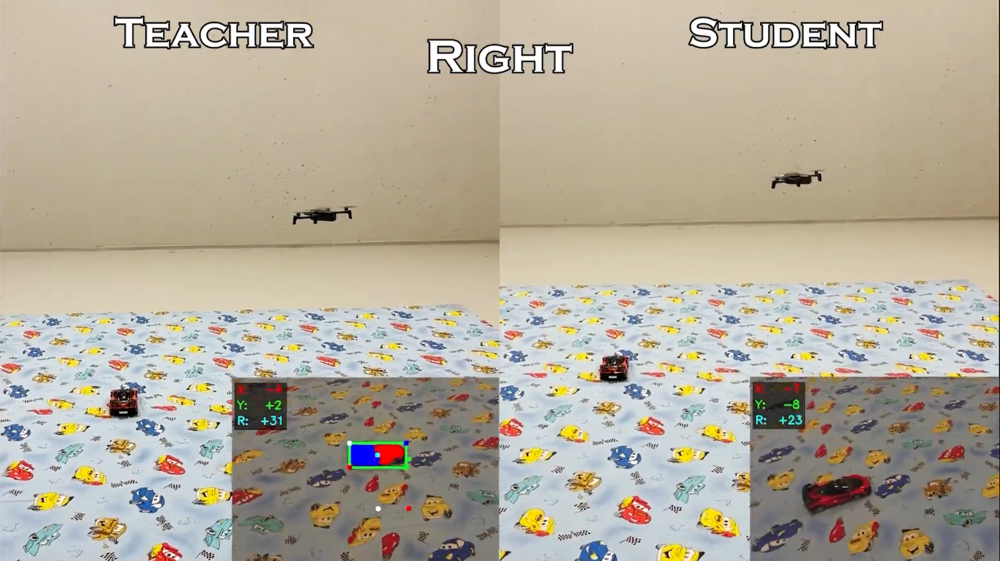

## High-Level Design
The system follows a teacher-student knowledge distillation approach:
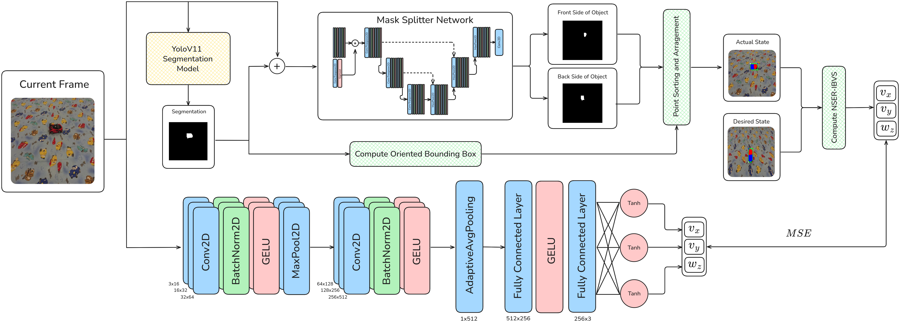

The Teacher path (NSER-IBVS) combines classical visual servoing with neural network-based perception to 
generate stable velocity commands. The Student path learns to directly regress these commands from RGB 
images, achieving 11x faster inference while maintaining comparable accuracy.

## System Components

### Teacher Path: NSER-IBVS Pipeline
The teacher consists of three main stages:
```bash
RGB Frame -> YOLOv11 Segmentation -> Mask Splitter -> Keypoint Extraction -> IBVS Control Law -> (vx, vy, ωz)
```

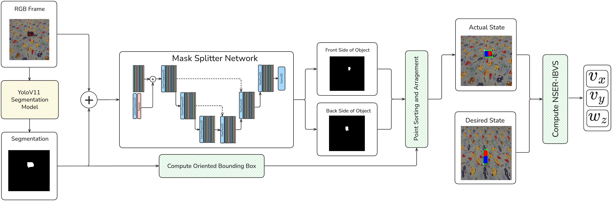

#### 1. Object Segmentation (YOLOv11 Nano):
- **Model:** YOLOv11 Nano instance segmentation (~2.84M parameters)
- **Purpose:** Detect and segment the target vehicle in the camera frame
- **Output:** Binary segmentation mask and bounding box
- **Implementation:** [auto_follow/detection/yolo_engine.py](../auto_follow/detection/yolo_engine.py)

The segmentation model is trained on synthetic data from the digital-twin and on real-world images.

#### 2. Mask Splitter Network (U-Net):
- **Model:** U-Net with attention mechanisms (~1.94M parameters)
- **Purpose:** Split the vehicle mask into anterior (front) and posterior (back) regions to infer vehicle pose
- **Input:** 4-channel tensor (RGB image + binary vehicle mask)
- **Output:** 2-channel mask (front and back segmentation)
- **Implementation:** [external/mask_splitter/mask_splitter/](../external/mask_splitter/mask_splitter) external 
submodule repository available [here](https://github.com/SpaceTime-Vision-Robotics-Laboratory/mask-splitter).

The mask splitter solves the keypoint ordering problem inherent in standard bounding box approaches. 
By determining which part of the vehicle is the front vs back, we can consistently order the four 
corner keypoints across frames.

**Architecture Details:**
- Encoder-decoder structure with skip connections
- Progressive downsampling: 32 → 64 → 128 → 256 channels
- Attention mechanism on mask channel for spatial feature modulation
- Dropout regularization in deeper layers
- Custom losses to ensure boundary reconstruction within the existent segmentation

#### 3. Keypoint Extraction and Ordering:
From the split masks, we extract an oriented bounding box with consistently ordered keypoints:
1. Compute bounding box around the full segmentation mask
2. Calculate centroids of front and back mask regions
3. Assign corner points to front/back based on proximity to centroids
4. Order points clockwise for temporal consistency


<table align="center">
  <tr>
    <td align="center">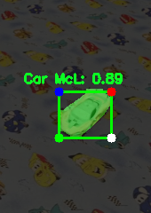<br>Naive Keypoints detection from YOLO</td>
    <td align="center">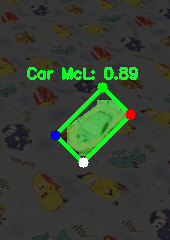<br>Recomputing Keypoints Analytically</td>
    <td align="center">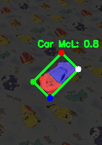<br>Ordered Keypoints Based on Pose</td>
  </tr>
</table>


This preprocessing ensures stable feature correspondence across frames, 
preventing the ambiguity that would destabilize the IBVS control loop.

**Implementation:** [auto_follow/detection/mask_splitter_ibvs.py](../auto_follow/detection/mask_splitter_ibvs.py)

#### 4. NSER-IBVS Control Law:
The Numerically Stable Efficient Reduced IBVS computes velocity commands by comparing 
current keypoints to reference (goal) keypoints.

<div align="center">
<table align="center">
  <tr>
    <td align="center">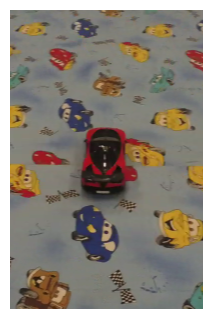<br>Reference (Goal) Image Real-World</td>
    <td align="center">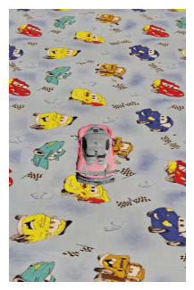<br>Reference (Goal) Image Simulated</td>
  </tr>
</table>
</div>


Our Reduced Formulation eliminates unnecessary degrees of freedom for quadrotor control at fixed altitude.
This reduction from 6-DOF to 3-DOF (vx, vy, ωz) improves numerical stability and computational efficiency.

**Implementation:** [auto_follow/ibvs/ibvs_controller.py](../auto_follow/ibvs/ibvs_controller.py), 
[auto_follow/ibvs/ibvs_math_fcn.py](../auto_follow/ibvs/ibvs_math_fcn.py)


### Student Path: Distilled Network
The student network learns to directly predict velocity commands from RGB images without explicit visual 
servoing computation.

```bash
RGB Frame (224x224) -> CNN Feature Extractor -> FC Layers -> (vx, vy, ωz)
```

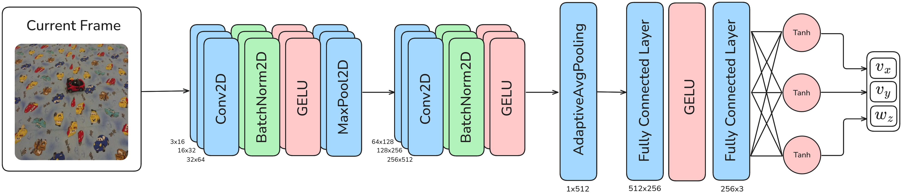

#### Network Architecture:
- **Parameters:** ~1.7M
- **Input:** RGB image resized to 224×224 pixels
- **Output:** 3 velocity commands (vx, vy, ωz)

#### Convolutional Backbone:
- 6 convolutional blocks with progressive channel increase: 16 → 32 → 64 → 128 → 256 → 512
- Each block: Conv2D → BatchNorm2D → GELU activation
- Max pooling after first two blocks
- Final layers use 3x3 kernels for fine-grained spatial features

#### Regression Head:
- Adaptive global average pooling (spatial dims → 1x1)
- FC layers: 512 → 256 → 3
- Tanh activation on output (bounded velocity commands which are between -100 and 100)

**Implementation:** [auto_follow/distiled_network/drone_command_regressor.py](../auto_follow/distiled_network/drone_command_regressor.py)

#### Training Process
The student is trained via knowledge distillation using MSE loss:
```bash
L = MSE(v_student, v_teacher)
```

**Training Details:**
- Velocity command normalization using empirically determined bounds based on the highest values from both 
real-world and digital-twin distributions (see table below)
- Two-stage training: pretrain on simulation, fine-tune on real-world
- Data augmentation: saturation shifts, brightness changes, salt-and-pepper noise
- Early stopping

**Velocity Bounds for Normalization:**

| Environment | νx (min/max) | νy (min/max) | ωz (min/max) |
|-------------|--------------|--------------|--------------|
| Simulation  | -24 / 16     | -9 / 9       | -27 / 40     |
| Real-world  | -30 / 30     | -30 / 30     | -40 / 40     |

Implementation: [student_train_pipeline/](../student_train_pipeline)

## Processors: Integration Layer
Processors orchestrate the interaction between controllers, detection engines, and the drone interface. They handle:
- Frame acquisition and preprocessing
- Detection/inference pipeline execution
- Command calculation and drone actuation
- Logging and visualization
- Mission termination conditions

### Important Processors
| Processor                                                                             | Description                               |
|---------------------------------------------------------------------------------------|-------------------------------------------|
| [IBVSSplitterProcessor](../auto_follow/processors/ibvs_splitter_processor.py)         | Full NSER-IBVS teacher processor pipeline |
| [DistilledNetworkProcessor](../auto_follow/processors/distilled_network_processor.py) | Student network processor pipeline        |
| [IBVSYoloProcessor](../auto_follow/processors/ibvs_yolo_processor.py)                 | Base class with common functionality      |

**Example Flow (IBVSSplitterProcessor):**
```python
def _process_frame(self, frame):
    # 1. Run detection pipeline which runs both YOLOv11n and Mask Splitter inference
    target_data = self.detector.find_best_target(frame)
    
    # 2. Calculate IBVS command
    command_info, logs = self.target_tracker.calculate_movement(target_data)
    
    # 3. Check termination conditions
    self.check_goal_reached(timestamp)
    self.check_timeout_landing(timestamp)
    
    # 4. Execute movement
    self.perform_movement(command_info)
```

Implementation: [auto_follow/processors/](../auto_follow/processors)

## Data Flow Diagram
```bash
┌─────────────────────────────────────────────────────────────────────────────┐
│                              TEACHER PATH                                   │
│  ┌──────────┐    ┌──────────┐    ┌──────────┐    ┌──────────┐    ┌────────┐ │
│  │  Camera  │───▶│ YOLOv11  │───▶│   Mask   │───▶│ Keypoint │───▶│  IBVS  │ │
│  │  Frame   │    │   Seg    │    │ Splitter │    │ Extract  │    │Control │ │
│  └──────────┘    └──────────┘    └──────────┘    └──────────┘    └────┬───┘ │
│                                                                       │     │
│                                                           ┌───────────┘     │
│                                                           ▼                 │
│                                                    ┌──────────────┐         │
│                                                    │ (vx, vy, ωz) │         │
│                                                    └──────┬───────┘         │
└───────────────────────────────────────────────────────────┼─────────────────┘
                                                            │
                        ┌───────────────────────────────────┤
                        │                                   │
                        ▼                                   ▼
               ┌────────────────┐                  ┌────────────────┐
               │  Training Data │                  │ Drone Command  │
               │  (RGB, Labels) │                  │   Execution    │
               └───────┬────────┘                  └────────────────┘
                       │
┌──────────────────────┼──────────────────────────────────────────────────────┐
│                      ▼          STUDENT PATH                                │
│  ┌──────────┐    ┌──────────┐                      ┌──────────────┐         │
│  │  Camera  │───▶│ Student  │─────────────────────▶│ (vx, vy, ωz) │         │
│  │  Frame   │    │   CNN    │                      └──────────────┘         │
│  └──────────┘    └──────────┘                                               │
└─────────────────────────────────────────────────────────────────────────────┘
```
                      

## Simulation Environment
The framework uses Parrot Sphinx with custom Unreal Engine 4 environments for training and evaluation.

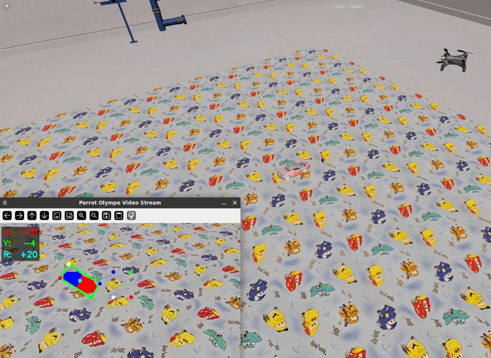

### Digital Twin Setup
- **Simulator**: Parrot Sphinx with Anafi 4K firmware
- **Environment**: Custom UE4 bunker with detailed assets made in [Blender](https://www.blender.org/)
- **Target**: Toy car model (digitized using [Hunyuan3D-2](https://github.com/Tencent-Hunyuan/Hunyuan3D-2))
- **Test Area**: 10x10x5 bunker-like environment with 5x4 meter carpet

### Test Scenarios
Eight starting poses around the target vehicle, covering the full trigonometric circle:

| Pose        | Position (x, y, z) | Orientation |
|-------------|--------------------|-------------|
| up-left     | (1, 1, 0.3)        | -135°       |
| up-right    | (1, -1, 0.3)       | 135°        |
| front-left  | (1.5, 0.3, 0.3)    | ~166°       |
| front-right | (1.5, -0.3, 0.3)   | ~166°       |
| left        | (0, 1, 0.3)        | -90°        |
| right       | (0, -1, 0.3)       | 90°         |
| down-left   | (-1, 1, 0.3)       | -45°        |
| down-right  | (-1, -1, 0.3)      | 45°         |


## Mission Termination
The system implements three termination conditions:

1. **Hard Goal**: Median error < 40px for 3 consecutive seconds
2. **Soft Goal**: Median error < 80px AND all velocity commands = 0 for 3 seconds
3. **Timeout**: 75 seconds maximum flight duration

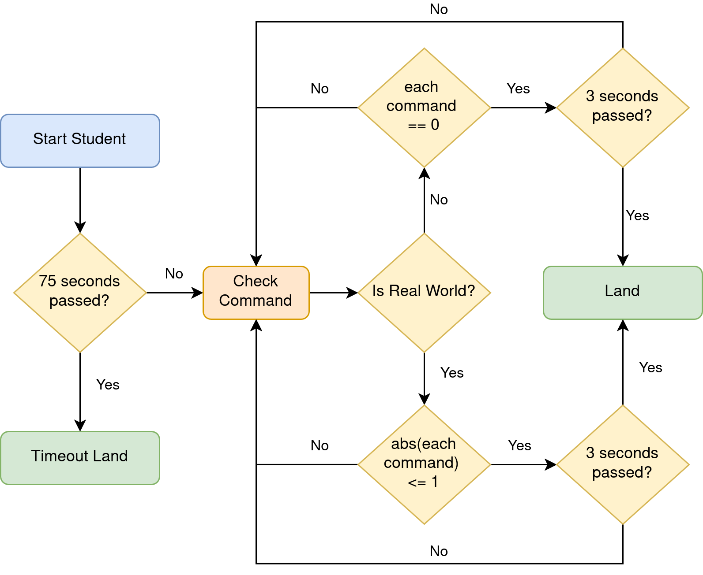

For the student network (evaluated independently without IBVS):
- All velocity command absolute values ≤ 1 for 3 consecutive seconds (statistically found from NSER-IBVS method)

## External Dependencies
The framework relies on three git submodules:

| Submodule          | Purpose                                                                         | Location                                                   |
|--------------------|---------------------------------------------------------------------------------|------------------------------------------------------------|
| `drone_base`       | Architecture and boilerplate code for Parrot drone communication via Olympe SDK | [external/drone_base/](../external/drone_base)             |
| `drone_sim_runner` | Simulation orchestration (environment, firmware, script lifecycle)              | [external/drone_sim_runner/](../external/drone_sim_runner) |
| `mask_splitter`    | Mask splitting network, training tools, and labeling utility                    | [external/mask_splitter/](../external/mask_splitter)       |

## Performance Characteristics
| Component         | Parameters | Inference Time | FPS      |
|-------------------|------------|----------------|----------|
| **Teacher Total** | **4.78M**  | **~20.69ms**   | **~48**  |
| **Student**       | **1.7M**   | **~1.85ms**    | **~541** |

*Measured on laptop GPU with 640×360 input resolution*

## How to Extend the Framework

### Adding New Targets
1. Collect and annotate segmentation data for the new target
2. Train YOLOv11n model with the annotated data
3. Label front/back regions using the interactive labeling tool from [mask splitter](https://github.com/SpaceTime-Vision-Robotics-Laboratory/mask-splitter)
4. Train mask splitter network on the new target
5. Update model paths in configuration files

### Adding New Controllers
1. Create a new controller in [auto_follow/controllers/](../auto_follow/controllers)
2. Implement a corresponding processor in [auto_follow/processors/](../auto_follow/processors)
3. Add configuration file in [config/simulator/](../config/simulator). Optional for digital-twin simulation
4. Create entry point script in [runnable/](../runnable)

### Custom Environments
1. Create new assets for the environment
2. Export assets as `.fbx` files (extension required by Parrot Sphinx)
3. Design level in Unreal Engine 4 following [Parrot Sphinx documentation](https://developer.parrot.com/docs/sphinx/prepare_worlds.html). Optional if you want to change the environment.
4. Create configuration YAML in [assets/environment/config/](../assets/environment/config). Optional if you want to inject meshes at different locations in the scene (so you don't build a new level for each new location) or if you want the meshes in multiple locations.
5. Update spawn points in [scripts/connect_drone_firmware.sh](../scripts/connect_drone_firmware.sh)

### Student Network
1. Run several simulations for the new task using the 
[auto_follow/simulator/simulation_loop_manager.py](../auto_follow/simulator/simulation_loop_manager.py),
[scripts/connect_drone_firmware.sh](../scripts/connect_drone_firmware.sh) or run in real-world. The more diversity the better
2. Use the generated raw `frames` and `.parquet` logs to train the student network with [student_train_pipeline/](../student_train_pipeline)
3. Test the newly trained network either in real-world or digital-twin. For best results first pre-train the model in the digital-twin if tests are good then fine-tune on real-world and test.

As always pay attention before flying the real drone.